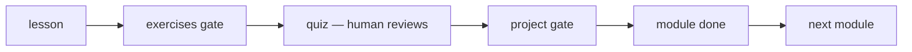

# 01 — How the Course Works

## MOTTO
> You don't watch this course. You build it.

## PROBLEM
Most courses are consumed: watch, nod, forget. This one is different — every
lesson makes you type code, pass exercises, answer a human-reviewed quiz, and
ship a project. If you don't know the rules, the gates surprise you.

## CONCEPT
Every module follows the same contract: **build-first** (plain Python before a
framework), **Six Beats** lessons (MOTTO → PROBLEM → CONCEPT with diagrams →
BUILD IT → USE IT → SHIP IT), and **three gates** — exercises gate lessons,
the HITL quiz and the project gate the module.



## BUILD IT

```bash
python3 lessons/01-how-the-course-works/code/build.py
```

Prints the module map (0-9) and your position — the course at a glance, in
plain Python.

## USE IT
The terminal tutor (`/learn`) is the same loop: recall → teach → HITL quiz →
track. The repo and the tutor teach the same course through the same gates.

## SHIP IT
Your `LEARNING.md` — written by `/start-learning`, updated by `/learn`. That
file IS the artifact: your mission, your path, your progress.
