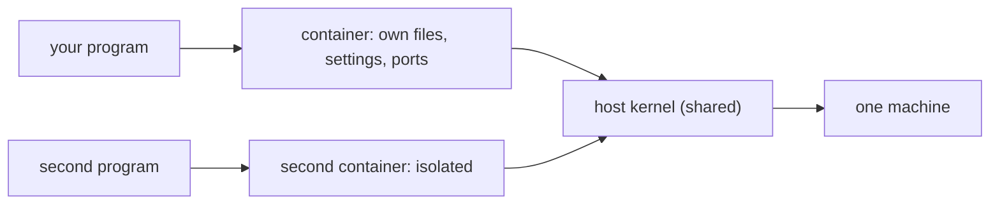

# 01 — What Is a Container?

## MOTTO
> A container is a program in a box: the same box on every machine.

## PROBLEM
Your code works on your laptop. On the server it crashes — Python version differs, a library is missing, a config file is not there. "It works on my machine" is a real daily cost: hours lost re-fixing the same thing in a new place. The program does not carry its world with it.

## CONCEPT
When you run a program, the OS starts a [process](../../../../glossary.md#process) with its own [PID](../../../../glossary.md#pid) and its own memory — but the **same files and settings as every other process**. Two programs can fight over one file, or need different versions of the same tool. That missing [isolation](../../../../glossary.md#isolation) is the root cause.

A [container](../../../../glossary.md#container) is that world: its own files, settings, and network [ports](../../../../glossary.md#port), started from a frozen blueprint called an [image](../../../../glossary.md#image). [Docker](../../../../glossary.md#docker) builds and runs boxes; [Docker Compose](../../../../glossary.md#docker-compose) starts many boxes from one config file with one command. Containers share the host kernel — they are not full virtual machines — which is why they start in milliseconds, not minutes.



**Diagram (whiteboard):** open `diagrams/container-walls.excalidraw` in excalidraw.com — same picture, traceable by hand.

## BUILD IT
We cannot build real containers in pure Python — but we can see the two forces that matter: the shared world and the box.

```bash
cd modules/01-production-infrastructure
python3 lessons/01-what-is-a-container/code/build.py
```

The build spawns real child processes with `subprocess`, prints their PIDs, lets two programs fight over one file in a shared directory, then drops each into its own box — a private directory and a clean environment — and shows the fight disappears. It ends with a measured number: how many milliseconds a process takes to start. That number is what a container adds isolation on top of.

## USE IT
Docker does this for real: filesystem, network, and process isolation from one image.

| Docker gives you | Docker hides from you |
|---|---|
| real isolation, one-command startup via Compose | the daemon and image layers |
| reproducible builds from a blueprint | the container networking model |
| same behavior on laptop and server | that you still share one kernel |

Honest trade-off: Docker kills "works on my machine", but adds a tool to learn and a layer to debug when it breaks.

## SHIP IT
A five-point checklist plus the one-command start for any compose stack — in `outputs/artifact.md`.
