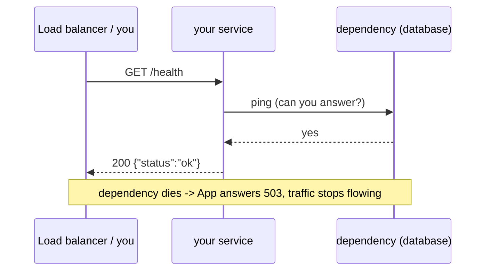

# 02 — APIs and Health Checks

## MOTTO
> A health check is a program holding up its hand and saying "I'm fine" — honestly.

## PROBLEM
Your service is running — is it *working*? A process that is alive can still be broken: hung on a dead database connection, out of disk, waiting forever on a dependency. Alive ≠ ready. Orchestrators, load balancers, and your own debugging all need one truthful question to ask: "are you actually fine?"

## CONCEPT
An [API](../../../../../glossary.md#api) is a set of defined requests one program makes to another. An [endpoint](../../../../../glossary.md#endpoint) is one address where a program answers. Every answer carries a [status code](../../../../../glossary.md#status-code): `200` means OK, `503` means "not ready". HTTP is the common language.

`GET /health` is the convention: the service checks its dependencies and answers honestly. A real health check is not "the process is running" — it is "everything I need is reachable, so I am ready to take work". That is why health checks exist: they turn a guess into a [status code](../../../../../glossary.md#status-code) a machine can act on.



**Diagram (whiteboard):** open `diagrams/health-check.excalidraw` in excalidraw.com — same picture, traceable by hand.

## BUILD IT
A complete health-checked service with the standard library — no framework:

```bash
python3 lessons/02-apis-and-health-checks/code/build.py --selftest
```

The build is a real HTTP server (`http.server`): `GET /health` returns `200 {"status":"ok"}` when its dependency flag is up, `503` when the dependency is down, plus a `/docs` stub and a `/__fail` demo switch. The self-test measures the answer time, breaks the dependency, and shows the health check telling the truth.

## USE IT
[FastAPI](../../../../../glossary.md#api) is the framework — same service, more for free.

| FastAPI gives you | FastAPI hides from you |
|---|---|
| automatic docs: interactive `/docs` + machine-readable `/openapi.json` from your type hints | the HTTP loop and JSON serialization |
| [async](../../../../../glossary.md#async) handlers that wait without blocking | the worker model (uvicorn) underneath |
| request validation from type hints | the raw request/response plumbing |

Honest trade-off: FastAPI turns three files of plumbing into three lines — but you no longer see the loop, so you must understand it to debug it.

## SHIP IT
The reusable health-check probe script and the "why health checks exist" one-pager — in `outputs/artifact.md`.
