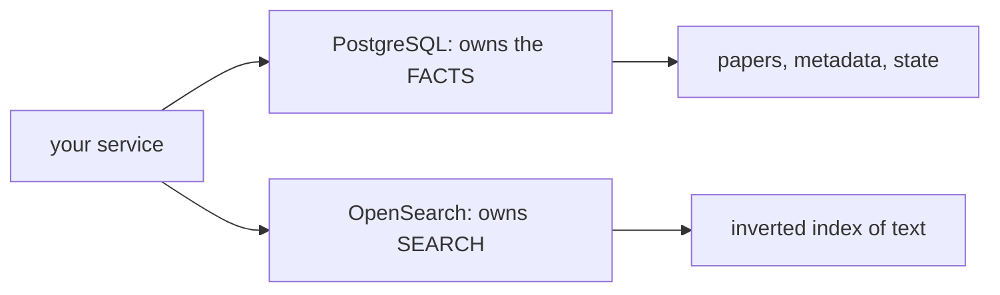

# 03 — Databases and Search

## MOTTO
> A database stores your facts; a search engine finds them fast.

## PROBLEM
A dictionary in memory loses everything when the program stops. Files survive, but searching thousands of them means reading every line. You need two different things you have been treating as one: *storage that survives restarts* and *search that does not scan everything*.

## CONCEPT
A [database](../../../../../glossary.md#database) stores data with a fixed [schema](../../../../../glossary.md#schema) and answers queries in [SQL](../../../../../glossary.md#sql). It stays fast on exact questions — "give me paper 42" — because of an [index](../../../../../glossary.md#index): a structure built once that finds rows without scanning all of them.

A [search engine](../../../../../glossary.md#search-engine) answers a different question: "find me the best matches for *rag retrieval*". It builds an [inverted index](../../../../../glossary.md#inverted-index) — a map from each word to the documents containing it — and ranks matches by score. Databases and search engines are different tools with different owners.



In this course's stack: [PostgreSQL (Postgres)](../../../../../glossary.md#postgresql-postgres) owns the paper metadata and pipeline state. [OpenSearch](../../../../../glossary.md#opensearch) owns keyword search over the abstracts. Each is good at exactly one job — that is why both exist.

**Diagram (whiteboard):** open `diagrams/db-vs-search.excalidraw` in excalidraw.com — same picture, traceable by hand.

## BUILD IT
SQLite is a database in one file, built into Python — perfect for seeing the concepts with zero setup:

```bash
python3 lessons/03-databases-and-search/code/build.py
```

The build writes papers to a real on-disk file, closes the connection, reopens it — the data is still there (persistence). Then it runs a naive keyword lookup that scores every row by word hits, measures it on 10 rows and again on 10,000, then creates an index and measures the same exact query twice: without and with index. Real numbers, same data, two speeds.

## USE IT
[PostgreSQL](../../../../../glossary.md#postgresql-postgres) and [OpenSearch](../../../../../glossary.md#opensearch) run in containers; your Python talks to them over the network.

| Tool gives you | Tool hides from you |
|---|---|
| Postgres: concurrency, crash safety, network access, real indexes | the server process, WAL, connection pooling, tuning |
| OpenSearch: inverted index, ranking, relevance scoring, scale | the index internals, shards, and query DSL |
| Compose: both start with `docker compose up -d` | memory footprint, config surface |

Honest trade-off: real databases give you durability and speed you cannot hand-build — but they are a server to run, secure, and tune. SQLite was honest for one program; Postgres is honest for many.

## SHIP IT
The one-command Postgres + OpenSearch start and the "what each owns" cheat sheet — in `outputs/artifact.md`.
