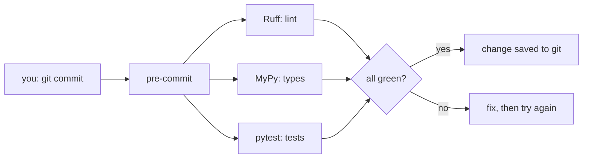

# 04 — Code Quality

## MOTTO
> Good code isn't just right — it's checkable, every single time.

## PROBLEM
Code that works today breaks tomorrow because of a style slip, a type mistake, or a missing test that nobody noticed. You cannot rely on memory or review alone. You need automated guards that run on every change and say, loudly, "no".

## CONCEPT
Four different guards, each catching a different class of mistake:

- a [linter](../../../../glossary.md#linter) (Ruff) checks style and catches mistakes before the code runs — unused imports, undefined names, dead code
- a [formatter](../../../../glossary.md#formatter) rewrites your code to one consistent style, so style debates disappear
- a [type checker](../../../../glossary.md#type-checker) (MyPy) checks the data types flow correctly — passing a `str` where an `int` is expected
- a [test](../../../../glossary.md#test) (pytest) checks behavior — the function returns what you promised

[pre-commit](../../../../glossary.md#pre-commit) is the gatekeeper: it runs the other three automatically before you save a change to git, and blocks the commit when anything fails. Quality becomes a pipeline, not a promise.



**Diagram (whiteboard):** open `diagrams/quality-gate.excalidraw` in excalidraw.com — same picture, traceable by hand.

## BUILD IT
A tiny module with three tests — plain Python, no framework:

```bash
python3 lessons/04-code-quality/code/build.py
```

The build is a small `Paper` module (slug, recency, keyword counting) with three test functions written as plain `assert`s and a hand-rolled runner. Same file, zero dependencies, three passes. It is written to pass Ruff's default rules — that is the lint-pass example: the learner can see what "checkable" code looks like before the tools take over.

## USE IT
The same module, guarded by the real tools — `uv` for the environment, Ruff for lint, MyPy for types, pytest for tests, pre-commit to run them all:

```bash
uv init && uv add --dev ruff mypy pytest pre-commit
ruff check . && mypy . && pytest
pre-commit install && pre-commit run --all-files
```

| Tools give you | Tools hide from you |
|---|---|
| machine-checked style, types, and behavior | the discipline to write the first good version |
| pre-commit runs everything, every commit | config drift when rules change |
| instant feedback in CI and on your laptop | the false sense that green means perfect |

Honest trade-off: linters and type checkers catch real bugs — but they also enforce opinions. Green is the floor, not the ceiling.

## SHIP IT
The complete quality gate: pre-commit config + one-command setup — in `outputs/artifact.md`.
