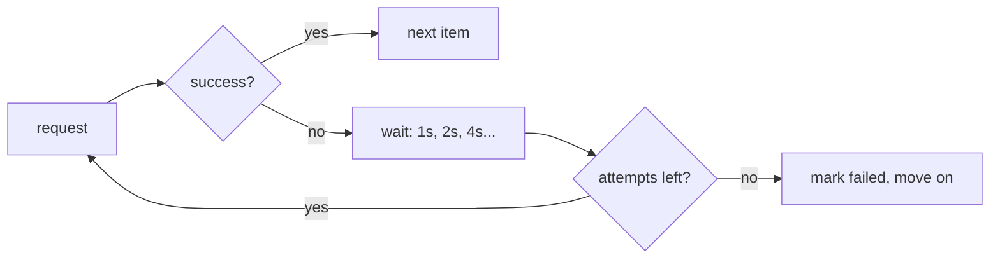

# 02 — Retries and Backoff

## MOTTO
> Be polite to the API: try again later, wait longer each time.

## PROBLEM
APIs are not your friend. They rate-limit, they time out, they go down at 3am. Hammer them and you get banned; give up on the first error and your pipeline is broken. The middle path: retry with backoff.

## CONCEPT
[Retry](../../../../../glossary.md#retry) = try again. [Backoff](../../../../../glossary.md#backoff) = wait before retrying, growing the wait each time. Exponential backoff (1s, 2s, 4s, 8s) respects rate limits; adding jitter (randomness) stops a fleet of clients from retrying in sync. The retry budget (max attempts) is the guard that keeps a broken API from hanging your pipeline forever.



**Diagram (whiteboard):** open `diagrams/retry-backoff.excalidraw` in excalidraw.com — same picture, traceable by hand.

## BUILD IT

```bash
python3 lessons/02-retries-and-backoff/code/build.py
```

A `fetch_with_retry(fn, attempts=4)` wrapper in plain Python: exponential backoff with jitter, a failing endpoint that recovers on attempt 3, and the printed wait times.

## USE IT
Client libraries (requests, httpx, the arXiv client) have retry/backoff built in.

| Library gives you | Library hides from you |
|---|---|
| retries, backoff, timeouts, connection pooling | the exact backoff math and budget |
| consistent behavior across endpoints | that you still choose the budget |

Honest trade-off: libraries save you the boilerplate, but you must still set the budget — and know what it means when it's hit.

## SHIP IT
The retry wrapper — `outputs/artifact.md`: a reusable `fetch_with_retry` you can paste into any pipeline.
