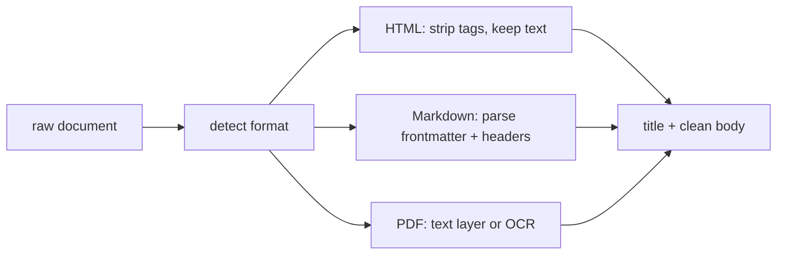

# 03 — Parsing Documents (and Why It's Hard)

## MOTTO
> A document is a blob until someone tells you where the text is.

## PROBLEM
An article arrives as HTML with navigation junk, or a PDF with no text layer, or markdown with frontmatter. `.read()` gives you a mess. The title is buried. The body has ads and footers. Parsing is where ingestion quietly dies.

## CONCEPT
Every format is a structure, and your job is to pull the CONTENT out of the STRUCTURE. HTML: tags wrap content — strip layout, keep text. Markdown: headers and frontmatter carry meaning. PDF: sometimes the text is drawn as shapes, not text — that's why PDF parsing is the worst. The parser's job: extract title + body + metadata, and fail loudly when it can't.



**Diagram (whiteboard):** open `diagrams/parse-formats.excalidraw` in excalidraw.com — same picture, traceable by hand.

## BUILD IT

```bash
python3 lessons/03-parsing-documents/code/build.py
```

A plain-Python parser that strips HTML tags with a regex/stack, extracts `<title>`, pulls markdown frontmatter, and reports what it found. No external parser.

## USE IT
[Docl*ng](https://github.com/ds4sd/docling) and friends parse PDFs/HTML/DOCX properly.

| Library gives you | Library hides from you |
|---|---|
| real PDF text extraction, table structure | the layout analysis internals |
| HTML → clean markdown | that models still make mistakes |

Honest trade-off: parsing libraries are worth it for PDFs. For plain HTML/markdown, 30 lines of Python is honest.

## SHIP IT
The tiny HTML/markdown extractor — `outputs/artifact.md` — paste into any ingestion job.
