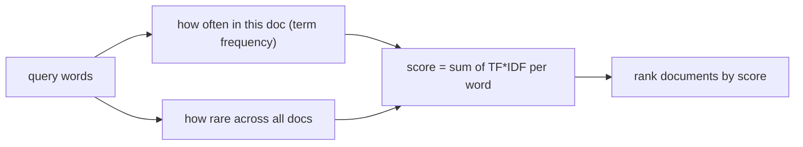

# 01 — BM25 by Hand

## MOTTO
> Ranking without AI: score a document by how many rare words it shares with the question.

## PROBLEM
A question like "why does my deploy run at 3am" — exact words. A naive matcher counts words: common words ("the", "run", "is") win, rare useful words get drowned out. You need a score that rewards rare, meaningful matches and ignores filler.

## CONCEPT
[BM25](../../../../../glossary.md#bm25) scores each document for a query: for every query word, how often does it appear in THIS document (term frequency), scaled by how RARE it is in the whole collection ([IDF](../../../../../glossary.md#idf)) — a word in every document teaches you nothing, so it scores ~0. Sum over query words = document score. Rank by score.



**Diagram (whiteboard):** open `diagrams/bm25-score.excalidraw` in excalidraw.com — same picture, traceable by hand.

## BUILD IT

```bash
python3 lessons/01-bm25-by-hand/code/build.py
```

BM25 in plain Python on 5 small documents: tokenize, compute IDF, score a query, rank. No libraries. The math is visible line by line.

## USE IT
[OpenSearch](../../../../../glossary.md#opensearch) ships BM25 out of the box.

| OpenSearch gives you | OpenSearch hides from you |
|---|---|
| BM25, index, query DSL, scale | the scoring internals, shards, tuning |
| filters + boosting for free | that the defaults (k1=1.2, b=0.75) are choices |

Honest trade-off: OpenSearch earns its keep at scale. On a few documents, 30 lines of Python is honest.

## SHIP IT
The BM25 scorer — `outputs/artifact.md` — paste into your notes search.
