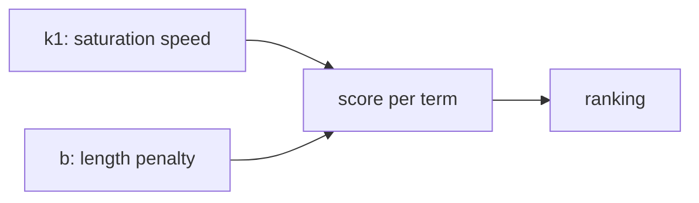

# 02 — The Two Knobs: k1 and b

## MOTTO
> k1 sets how fast a word's payoff saturates; b punishes long documents.

## PROBLEM
BM25 scored your search — but two documents match equally, and the ranking feels wrong. A long doc repeats a word 10 times; a short one says it once. Who wins? And when does a word appearing 20 times deserve less credit per appearance than the 1st time? Two knobs answer both.

## CONCEPT
[k1](../../../../glossary.md#k1) controls term-frequency saturation: at k1=0, only presence matters (word there = yes/no); higher k1 lets more repetitions add score, but each extra one pays less. [b](../../../../glossary.md#b) controls length normalization: at b=0, length is ignored; at b=1, long documents are fully penalized. Defaults (1.2, 0.75) work for most text — but your documents (short notes vs long papers) may want different values.



## BUILD IT

```bash
python3 lessons/02-k1-and-b/code/build.py
```

Same query, same docs, three settings: (k1=0, b=0), (k1=1.2, b=0.75), (k1=5, b=1). Watch the ranking change and read WHY.

## USE IT
OpenSearch exposes `k1` and `b` per index — tuning them is real production work.

| OpenSearch gives you | OpenSearch hides from you |
|---|---|
| per-index k1/b settings | that you must choose them for YOUR data |
| A/B testing against your queries | the default is a guess, not a law |

Honest trade-off: knobs are cheap to turn, expensive to choose — measure on your own query set.

## SHIP IT
The knob experiment — `outputs/artifact.md`: the three-settings comparison and how to pick yours.
