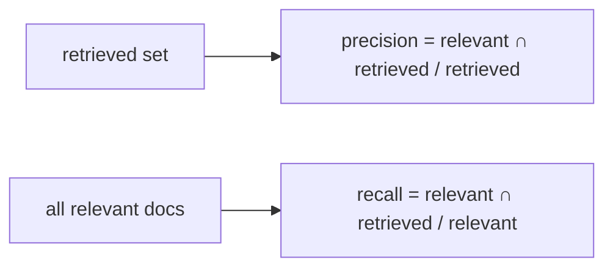

# 03 — Precision and Recall

## MOTTO
> Precision: everything I returned was relevant. Recall: everything relevant got returned. You can't have both maxed.

## PROBLEM
Your search returns 10 results — 4 are what you wanted. That's a precision problem. Or it returns only 2 of the 7 relevant documents that exist — that's a recall problem. Search feels "fine" until you measure it, and you can't fix what you can't count.

## CONCEPT
[Precision](../../../../../glossary.md#precision) = relevant returned ÷ total returned. [Recall](../../../../../glossary.md#recall) = relevant returned ÷ relevant that exist. They trade off: returning everything gives 100% recall and awful precision; returning one perfect doc gives 100% precision and terrible recall. The right mix depends on the task — a search box wants precision, a RAG retriever wants enough recall that the answer chunk is in the top-k.



**Diagram (whiteboard):** open `diagrams/prec-recall.excalidraw` in excalidraw.com — same picture, traceable by hand.

## BUILD IT

```bash
python3 lessons/03-precision-and-recall/code/build.py
```

A tiny labeled set (5 queries, known-good docs). Run BM25 at k=1, k=3, k=5 — compute precision and recall at each k, watch the trade-off appear as numbers.

## USE IT
Search analytics tools measure these for you over real logs.

| Tool gives you | Tool hides from you |
|---|---|
| precision/recall over your real queries | that you must LABEL what "relevant" means |
| dashboards and drift alerts | the labeling effort |

Honest trade-off: measurement requires a labeled set — that's the cost of knowing your search is good.

## SHIP IT
The precision/recall harness — `outputs/artifact.md`: label 5 queries, score any ranker.
