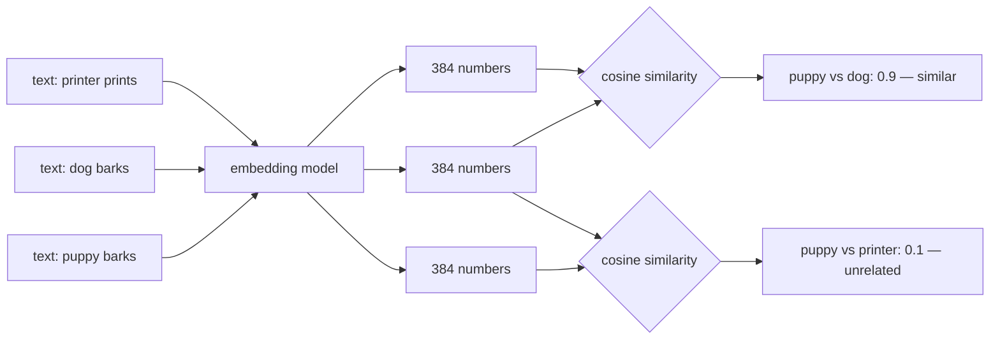

# 02 — Embeddings (the 384 Numbers)

## MOTTO
> Meaning as numbers: "puppy" sits close to "dog", far from "printer".

## PROBLEM
Module 03's keyword search fails on the classics: a note says "settle a bill", the question says "pay an invoice" — zero shared words, zero match. Words are too strict. A machine needs a way to compare *meanings*, not spellings. But meaning is not a string — so what numbers do you compare?

## CONCEPT
An [embedding](../../../../../glossary.md#embedding) is a [vector](../../../../../glossary.md#vector) — a fixed list of numbers — where each number is one [dimension](../../../../../glossary.md#dimension). "384 numbers" means 384 dimensions: every piece of text becomes 384 numbers. A model is trained to place similar meanings at nearby spots, so closeness in the numbers means closeness in meaning. Closeness is measured with [cosine similarity](../../../../../glossary.md#cosine-similarity): the angle between two vectors. Near 1 = pointing the same way = similar. Near 0 = unrelated. You can prove the whole idea with random numbers: a vector vs itself scores 1.0, a vector vs a random other scores ~0, and two vectors built from similar word lists score in between — closeness shows up even with no machine learning in sight.



**Diagram (whiteboard):** open `diagrams/embeddings-map.excalidraw` in excalidraw.com — same picture, traceable by hand.

## BUILD IT

```bash
python3 lessons/02-embeddings/code/build.py
```

All [stdlib](https://docs.python.org/3/library/): `hashlib` + `math`. First, cosine similarity by hand on seeded random 384-number vectors — a vector vs itself scores 1.0, a vector vs an unrelated one scores ~0. Then word-count stand-ins: each text becomes a 384-bucket count vector, so "a puppy that barks" and "a dog that barks" point close while "a printer that prints" points far. The printed cosine table is the whole lesson.

## USE IT
Real embedders ship the same 384-number idea with trained models. [Ollama](../../../../../glossary.md#ollama) runs one locally (e.g. nomic-embed-text, 768 dimensions), Jina AI and OpenAI serve them over an API. Same cosine math, bigger numbers. And embedders fail like any API — rate limits, timeouts, a local model that isn't installed. The [fallback](../../../../../glossary.md#fallback) chain: cached embeddings first → keyword search (module 03) if the embedder is down → a smaller local model. A dead embedder must never take down the whole index.

| Real embedder gives you | Real embedder hides from you |
|---|---|
| trained meaning (384+ dimensions) | the training data and the math inside |
| a one-line API call | latency, cost, and rate limits |
| consistency across texts | that you still own the fallback chain |

Honest trade-off: the model does the learning — but "what to do when it's down" is yours.

## SHIP IT
The by-hand cosine + the fallback chain — `outputs/artifact.md`: the functions to paste into any index, and the checklist for surviving a dead embedder.
