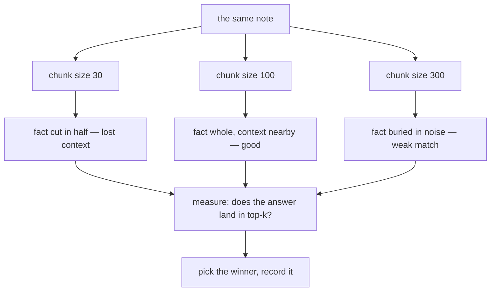

# 03 — Chunk Size Matters

## MOTTO
> Too big, the answer drowns in noise. Too small, the answer is cut in half.

## PROBLEM
You chunked, you embedded — and the results are still bad. The suspect: chunk size. Same text, same embedder, different size, very different answers. Pick a size blindly and you will never know why a query failed. Size is a knob — and knobs need measurement, not vibes.

## CONCEPT
Every chunk size is a trade. Big chunks (300+ words) carry context, but the one answer sentence drowns — the [embedding](../../../../../glossary.md#embedding) of a 300-word chunk averages five topics into one mushy [vector](../../../../../glossary.md#vector), so the chunk matches everything a little. Small chunks (30 words) match precisely, but context is lost: "it lives near rivers" in chunk 4 means nothing when the word "capybara" lives in chunk 3. [Chunk overlap](../../../../../glossary.md#chunk-overlap) patches the cut, and the answer to "which size?" is measurement: run your real queries at 3 sizes and count how often the answer chunk lands in the top results.



## BUILD IT

```bash
python3 lessons/03-chunk-size-matters/code/build.py
```

One note, a [fixed-size chunker](../../../../../glossary.md#fixed-size-chunker), three sizes (30 / 100 / 300 words). The build prints every cut, then measures: for the chunk that holds the answer sentence, its word count and its signal ratio (answer words ÷ chunk words). At 30 the fact is split across a boundary; at 300 the same fact is one sentence inside a wall. Numbers, not vibes.

## USE IT
Framework splitters (LangChain and friends) all take a `chunk_size` knob — but the knob is a number, not a decision.

| Framework gives you | Framework hides from you |
|---|---|
| `chunk_size` and `overlap` as plain parameters | that the right value is different for YOUR notes |
| re-running the split for free | that you still have to judge the results |
| one call for any file type | the measurement loop that picks the size |

Honest trade-off: the framework parameterizes the choice. It cannot tell you 30 vs 100 vs 300 — only your queries can.

## SHIP IT
The size experiment — `outputs/artifact.md`: the 3-size test to run on your own notes, and the checklist that turns the winner into a recorded decision.
