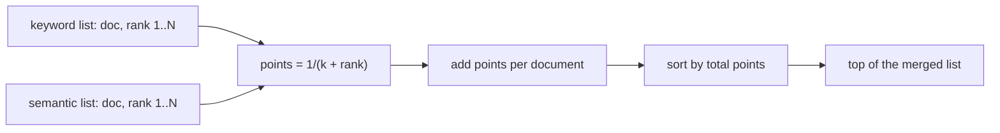

# 01 — Reciprocal Rank Fusion, by Hand

## MOTTO
> Two rankers, one merged list: give every document points by POSITION, not by score.

## PROBLEM
You built a keyword search (Module 03) and a semantic search (Module 04). Each returns a ranked list for the same question. Keyword scores look like `9.8, 7.4, 4.1`. Semantic scores look like `0.94, 0.91, 0.85`. How do you merge them into ONE list? If you average the raw numbers, the engine with the bigger scale silently wins — the other list becomes decoration. You need a merge that is fair to both engines.

## CONCEPT
[Reciprocal Rank Fusion](../../../../../glossary.md#reranking--rank-fusion) (RRF) ignores scores and looks only at POSITIONS. For each list, a document earns `1/(k + rank)` points — rank 1 gets `1/(k+1)`, rank 2 gets `1/(k+2)`, and so on. Points from every list are added. The constant `k` (usually 60) softens the bonus for the very top: rank 1 vs rank 2 differs by only a tiny bit, so no single engine's top pick dominates the vote.

Why does position beat score? Scores from different engines live on different scales — you cannot add meters and kilograms. Worse, one weird score (a document scoring 999) can hijack an average. Positions are fair: every engine votes equally, and a document that BOTH engines rank highly always beats a document only one engine loves.



**Diagram (whiteboard):** open `diagrams/rrf-fusion.excalidraw` in excalidraw.com — same picture, traceable by hand.

## BUILD IT

```bash
python3 lessons/01-rrf-by-hand/code/build.py
```

A plain-Python `rrf(ranked_lists, k=60)`: loop over each list, give `1/(k+rank)` points, add them up, sort. The build then shows the trap: score averaging lets keyword's `9.8` dwarf semantic's `0.02`, while RRF asks "what did each ENGINE think?" and crowns the document both engines half-agree on.

## USE IT
[Elasticsearch](../../../../../glossary.md#search-engine) ships RRF natively (called `rank_fusion`). OpenSearch fuses differently — it normalizes scores and adds them, which is arithmetic, not rank-based.

| The framework gives you | The framework hides from you |
|---|---|
| fusion out of the box, tuned defaults | the `k` constant and why 60 is usual |
| a hybrid query in one request | that fusion needs two good retrievers first |
| `k` per sub-query, weights | the scale problem it silently dodges |

Honest trade-off: the framework is 3 lines, but you just built the same 15 lines — and now you know what `k` does when it breaks.

## SHIP IT
The RRF function — `outputs/artifact.md` — paste it into any search that needs two lists merged.
