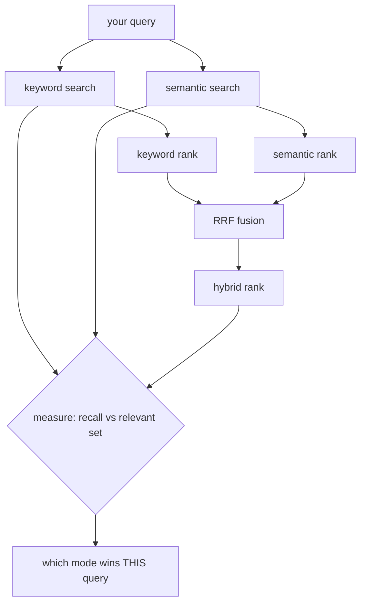

# 02 — When Hybrid Wins

## MOTTO
> Keyword finds the exact word. Meaning finds the same idea. Hybrid finds both.

## PROBLEM
You have two searches. Each fails in its own way. Keyword search misses notes that say the same thing in different words. Semantic search gets fooled by notes that merely LOOK like the question (a one-word tag, a note titled exactly like the query). You need to know, per query, which engine to trust — and how to get both engines' best ideas at once.

## CONCEPT
A query falls into one of three camps. **Exact-token queries** — the answer contains the query's own rare words — [keyword search](../../../../../glossary.md#bm25) wins. **Meaning queries** — the answer paraphrases the query — [semantic similarity search](../../../../../glossary.md#semantic-similarity-search) wins. **Split queries** — two answers, one matches by word, one by meaning — only fusion (RRF, lesson 01) finds both. Recall is the measure: how many of the relevant notes the [retriever](../../../../../glossary.md#retriever) actually returned. You cannot know the camp without MEASURING — run the query through all three modes, count what each found.



**Diagram (whiteboard):** open `diagrams/hybrid-wins.excalidraw` in excalidraw.com — same picture, traceable by hand.

## BUILD IT

```bash
python3 lessons/02-when-hybrid-wins/code/build.py
```

Three plain-Python engines over one corpus of 8 notes: a tf x idf keyword ranker, a cosine-over-random-vectors semantic ranker (a STAND-IN for a real embedding model), and RRF fusion. The build MINES the corpus — it prints each mode's ranking for three queries and measures recall@1 and recall@2. The stand-in is honest about its limits: it senses token overlap and note length, not meaning, so it mostly agrees with keyword. Real embeddings know synonyms and disagree much more — but the disagreement machinery you see here is the same.

## USE IT
Real systems fuse a real BM25 list with a real embedding list — e.g. OpenSearch for keyword and pgvector for embeddings, fused with RRF.

| The framework gives you | The framework hides from you |
|---|---|
| two retrievers + fusion in one query | that fusion can't fix a bad retriever |
| normalized scores, weights | the `k` and where to put it |
| a hybrid endpoint | which mode actually wins YOUR queries |

Honest trade-off: frameworks fuse for you, but the "which camp is this query" question is still YOUR measurement.

## SHIP IT
The mining pattern — `outputs/artifact.md` — a checklist for finding hybrid-wins queries in YOUR notes.
