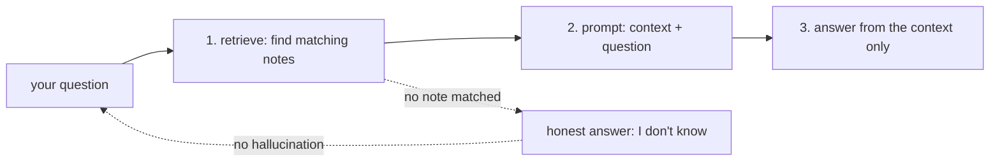

# 01 — The RAG Flow

## MOTTO
> Find the right note first, then ask the model to read it.

## PROBLEM
Your notes are about deploy, embeddings, Ollama — fifty of them, growing. You ask the model: "how do I run a local model?" The model has never seen your notes. Paste nothing → it makes things up. Paste everything → slow, expensive, and the useful note gets buried in noise. Both ways fail. The fix is not a bigger prompt. The fix is a flow.

## CONCEPT
[RAG](../../../../../../glossary.md#rag) is a three-step flow that lets the model answer from YOUR notes:

1. **Retrieve** — search your notes for the pieces that match the question. You already built the search in module 03 (keyword / BM25). The [retriever](../../../../../../glossary.md#retriever) picks the top [k](../../../../../../glossary.md#k) notes.
2. **Prompt** — pack the found pieces (the context) and the question into one instruction, using a [prompt template](../../../../../../glossary.md#prompt-template).
3. **Answer** — the [LLM](../../../../../../glossary.md#llm) reads the prompt — everything inside its [context window](../../../../../../glossary.md#context-window) — and answers from the context only.

An answer that comes from your notes is **grounded**. When no note matches, the honest reply is "I don't know" — that is how grounding stops [hallucination](../../../../../../glossary.md#hallucination).



**Diagram (whiteboard):** open `diagrams/rag-flow.excalidraw` in excalidraw.com — same picture, traceable by hand.

## BUILD IT

```bash
python3 lessons/01-the-rag-flow/code/build.py
```

Plain Python, stdlib, no API keys. Three functions — `retrieve`, `build_prompt`, `fake_model` — wired by `answer()`. The model is FAKE on purpose: it reads the prompt and answers from the context, so you see the flow's shape before any real model exists. Run it and you get measured numbers like:

```
question: how do I run a local model?
  retrieved 2 of 5 notes: embeddings.md, ollama.md
  prompt size: 468 chars, ~117 tokens
  answer: From your notes: [ollama.md] Ollama runs large language models...
```

Try your own questions. Ask something that is in no note and watch it refuse instead of inventing an answer — that refusal is the whole point of grounding.

## USE IT
[Ollama](../../../../../../glossary.md#ollama) runs a real local model on your own machine. The flow does not change — only the model does. Pull a small model and talk to it:

```bash
ollama pull llama3.2:1b        # once, downloads a small model
ollama run llama3.2:1b "say ok"
```

(or use the Ollama service from module 01's stack: `docker compose exec llm ollama run llama3.2:1b "say ok"`).

A real model call is one HTTP request to your own machine — swap `fake_model` for this:

```python
import json, urllib.request
req = urllib.request.Request(
    "http://localhost:11434/api/generate",
    data=json.dumps({"model": "llama3.2:1b", "prompt": prompt, "stream": False}).encode(),
    headers={"Content-Type": "application/json"},
)
print(json.loads(urllib.request.urlopen(req).read())["response"])
```

| Local (Ollama) gives you | Local hides from you |
|---|---|
| privacy — data never leaves the machine | weaker models than the cloud's biggest |
| no per-token cost, works offline | your laptop does the heavy math (slower) |
| a real model for the module 06 project | that a 1B model is small and limited |

Honest trade-off: local wins on privacy and price, loses on model strength and speed. For private notes, local is the right call.

## SHIP IT
The three-step flow — `outputs/artifact.md`: a runnable retrieve → prompt → answer skeleton you can point at any note corpus.
