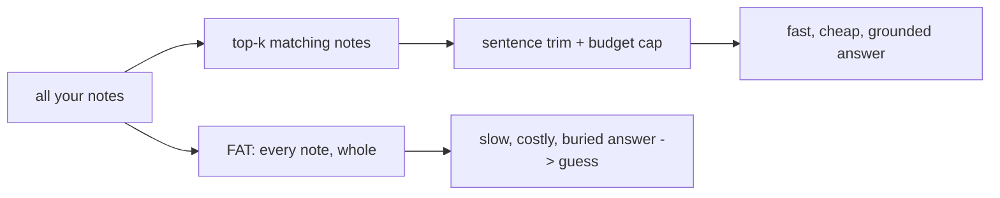

# 02 — Prompt Trimming

## MOTTO
> A fat prompt costs more, answers slower, and buries the answer.

## PROBLEM
Naive RAG stuffs EVERY note into the prompt. With 50 notes that is 1,250 tokens — and with 500 notes, 12,500. The model reads every token before it answers: more tokens, more time, more cost. Worse: the one useful note sits at the bottom of the pile, and a small model never reaches it — it answers from noise and guesses. Fat prompts are not just wasteful. They are wrong.

## CONCEPT
The [LLM](../../../../../../glossary.md#llm) reads your whole prompt before answering. [Tokens](../../../../../../glossary.md#tokens) are the small pieces of words the model counts — every token in the prompt is paid for (cost) and read (latency). So shrink the prompt to what answers the question:

- **k** — how many [chunks](../../../../../../glossary.md#chunk) you retrieve (from module 04).
- **Sentence trim** — inside each chunk, keep only the sentences that contain a question word.
- **Budget cap** — hard stop: once the prompt hits N tokens, stop adding.

The old way answers slow and wrong; the trimmed way answers fast and right. (The failure of fat prompts is the [needle-in-haystack](../../../../../../glossary.md#needle-in-haystack) problem — the fact is there, the model just can't see it.)



## BUILD IT

```bash
python3 lessons/02-prompt-trimming/code/build.py
```

Builds the SAME prompt two ways over a simulated 50-note folder (45 filler + your 5 real notes, `deploy.md` buried at the end), then measures both and lets a weak model answer both. Reference run:

```
FAT      prompt: 5009 chars = 1253 tokens   time: 1260 ms
         answer: I'd guess the deploy schedule changed last week.   <- hallucination

TRIMMED  prompt:  295 chars =   74 tokens   time:   77 ms
         answer: From your notes: [deploy.md] Nightly deploys fail when
                 environment variables are missing.                  <- grounded
```

Trimmed is **17x smaller and ~17x faster** — and it got the right answer. The fat prompt made the weak model hallucinate because the answer sat beyond its reach. Note: `chars / 4` is an estimate; the real model reports the exact token count.

## USE IT
Run the same two prompts through a real local model and read the real numbers. Ollama's reply includes exact token counts and durations:

```python
import json, urllib.request
def ollama(prompt):
    req = urllib.request.Request(
        "http://localhost:11434/api/generate",
        data=json.dumps({"model": "llama3.2:1b", "prompt": prompt, "stream": False}).encode(),
        headers={"Content-Type": "application/json"},
    )
    return json.loads(urllib.request.urlopen(req).read())
fat = ollama(fat_prompt)         # compare prompt_eval_count
trim = ollama(trimmed_prompt)    # and eval_duration
```

| Ollama gives you | Ollama hides from you |
|---|---|
| real token counts (`prompt_eval_count`) and real durations | the internal tokenizer details |
| honest per-prompt latency numbers | that you still choose k and the budget |

Honest trade-off: trimming is a judgment call — too aggressive and you cut the answer out of the context. Measure both ways, on your own questions, and pick the budget your data needs.

## SHIP IT
The trimming recipe — `outputs/artifact.md`: k, sentence trim, budget cap, and the "measure before/after" rule.
