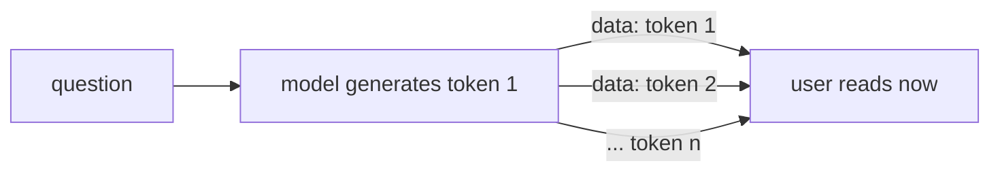

# 03 — Streaming (SSE)

## MOTTO
> The first token beats the last token.

## PROBLEM
A model generates an answer one token at a time — that takes a second for a small model, much longer for a big one. If your app waits for the whole answer, the user stares at a loading spinner for a minute. It feels broken, even when the machine is working fine. The fix: don't wait. Send each token the moment it is born.

## CONCEPT
The model does not produce the answer in one piece. It produces a stream of tokens. **Streaming** = forward each token to the user as it arrives. **SSE** (Server-Sent Events) is the simple web format for this: one open connection, and the server pushes `data: <payload>` lines, each followed by a blank line, until it is done.

Two numbers matter. **First-token latency** — how long until the user sees the first word (this is what they FEEL). **Total latency** — how long until the whole answer is done (this is what the machine measures). Streaming makes the felt time tiny and lets the user read while the model keeps writing.



## BUILD IT

```bash
python3 lessons/03-streaming/code/build.py
```

Plain Python, stdlib. A generator (`token_stream`) yields the answer one token at a time; `sse_event` wraps each in a proper SSE frame; a tiny `http.server` streams those frames over the network; a client reads them the moment they arrive and times what the user feels. Reference run (yours will differ slightly — timing is hardware-dependent):

```
first token after    23.9 ms
whole answer after 1218.4 ms
-> the user starts reading 51x sooner than with a non-streaming answer
```

You can also watch it live: while the build runs, `curl -N http://127.0.0.1:<port>/stream` in another terminal shows the tokens arriving one per line.

## USE IT
Ollama streams natively. In the terminal, `ollama run llama3.2:1b` already prints tokens as they are generated. In Python, set `"stream": true` and read the reply line by line:

```python
import json, urllib.request
req = urllib.request.Request(
    "http://localhost:11434/api/generate",
    data=json.dumps({"model": "llama3.2:1b", "prompt": prompt, "stream": True}).encode(),
    headers={"Content-Type": "application/json"},
)
for raw in urllib.request.urlopen(req):
    print(json.loads(raw)["response"], end="", flush=True)
```

Ollama's OpenAI-compatible endpoint (`/v1/chat/completions` with `stream: true`) emits the same SSE `data:` frames a browser expects, ending with `data: [DONE]`.

| Streaming gives you | Streaming hides from you |
|---|---|
| first-token latency — what users feel | connection handling and partial replies |
| answers that look alive, cancel-able | that you must flush and frame each event |
| honest per-token numbers | that short answers barely benefit |

Honest trade-off: streaming adds plumbing (flush, framing, connection management). For short answers or offline batch jobs it buys little. For anything a human waits on, it is the difference between "broken" and "working".

## SHIP IT
The SSE streaming pattern — `outputs/artifact.md`: the generator, the frame, the flush, and when to stream.
