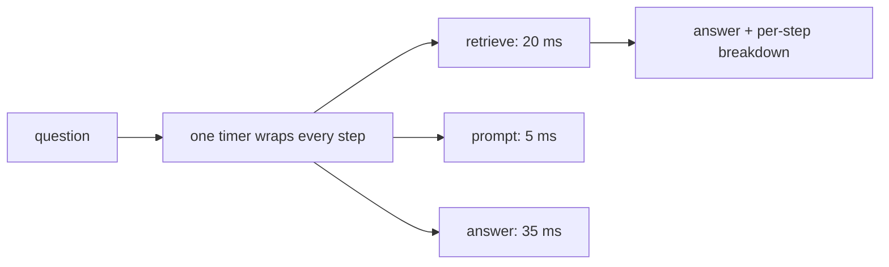

# 01 — Trace the Request

## MOTTO
> You can't fix what you can't see. Time every step.

## PROBLEM
Your RAG answer feels slow. "It's slow" is not a plan — slow where? The
search? The prompt? The model? Without a timer around each step you guess.
Guessing is how you optimize the wrong thing and ship a fix for nothing.

## CONCEPT
A [trace](../../../../../glossary.md#trace) is a recorded log of every step of one
request: name, start, end, duration. A RAG answer has three steps:
[retrieve](../../../../../glossary.md#retriever) (find the chunks), prompt (build
the [prompt template](../../../../../glossary.md#prompt-template)), and answer
(the [LLM API call](../../../../../glossary.md#llm-api-call)). Wrap each step in a
named timer — that's [observability](../../../../../glossary.md#observability):
you can *see* the system. Now you get a per-step breakdown: retrieve 30 ms,
prompt 5 ms, answer 20 ms. The breakdown shows where the time goes — usually
the model, sometimes the search. The fix targets the slow step, not the one
that's loud.



## BUILD IT

```bash
python3 lessons/01-trace-the-request/code/build.py
```

A `Tracer` class in plain Python: `step(name, fn)` times any step, records it,
and the report prints milliseconds and percent of total. Run it — the
breakdown shows where the ~60 ms went, and the slowest step (the model call)
names itself.

## USE IT
[Langfuse](https://langfuse.com) records the same thing for you at scale: one
decorator wraps any function and it becomes a traced
[span](../../../../../glossary.md#span) in a web UI, with latency and cost per
call.

| Langfuse gives you | Langfuse hides from you |
|---|---|
| automatic spans, per-step latency, a shared UI | that a span is just a named timer around your code |
| token counts and cost per call, per user | that you still decide what to wrap and where |

Honest trade-off: Langfuse earns its keep when many services and many users
need one place to look. For one script, 20 lines of `Tracer` is honest.

## SHIP IT
The tracer pattern — `outputs/artifact.md`: a paste-anywhere `Tracer` plus the
per-step breakdown checklist, so every answer you ship can answer "where did
the time go?"
