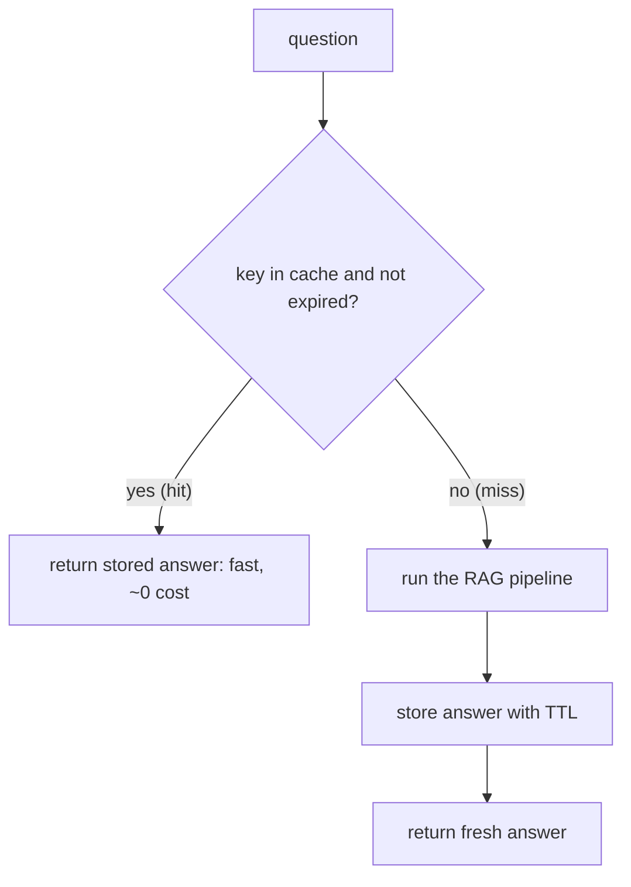

# 02 — Cache with TTL

## MOTTO
> If you already answered it, answer it again — instantly, for free.

## PROBLEM
Users ask the same questions over and over. Every repeat re-runs the whole
pipeline: search, prompt, model call. Same question, same answer, full price,
full latency. You're paying twice for work you already did — and the answer is
waiting for the model while it could come back in a millisecond.

## CONCEPT
A [cache](../../../../glossary.md#cache) is a place that remembers answers.
The [cache key](../../../../glossary.md#cache-key) is the question (trimmed
and lowercased so "What is RAG?" and "what is rag?" are the same key). Ask:
look up the key. A [hit](../../../../glossary.md#hit) — found — returns the
stored answer and skips the pipeline. A [miss](../../../../glossary.md#miss) —
not found — runs the pipeline and stores the answer for next time. A
[TTL](../../../../glossary.md#ttl-time-to-live) (time-to-live) is the expiry:
after TTL seconds the entry dies and the pipeline runs again. TTL stops stale
answers and keeps memory from growing forever. The
[hit rate](../../../../glossary.md#hit-rate) = hits ÷ total questions: 90%
means 9 of every 10 questions never touch the model.



## BUILD IT

```bash
python3 lessons/02-cache-with-ttl/code/build.py
```

A `TTLCache` in plain Python: a dict of (value, expires-at), `get` checks the
clock, expired entries are deleted and count as misses. Run it — repeated
questions hit, one entry is proven expired, and the hit rate plus the cost
before/after caching are printed.

## USE IT
[Redis](https://redis.io) is the same idea — shared by every server and every
process, with TTL built in.

| Redis gives you | Redis hides from you |
|---|---|
| a cache any process can reach, over the network | the connection, the serialization, the network call |
| TTL, eviction, and persistence built in | that eviction policy and key design are still your job |

Honest trade-off: Redis earns its keep when many servers share one cache. For
one local script, a dict with timestamps is honest.

## SHIP IT
The TTL cache pattern — `outputs/artifact.md`: the expiry-check checklist for
any cache, so the next cache you build doesn't serve stale answers forever.
