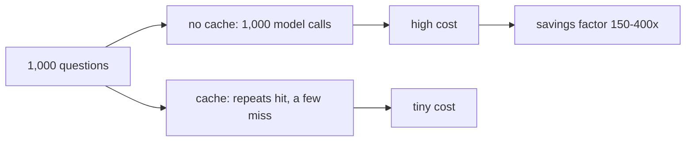

# 03 — Cost per Question

## MOTTO
> You don't pay per question. You pay per token.

## PROBLEM
The bill arrives: $23.47. For what? Nobody knows. Without counting tokens per
question you can't say which questions are expensive, whether caching helped,
or what 1,000 questions will cost next month. You're flying blind on money —
and the finance person will ask.

## CONCEPT
[Tokens](../../../../../glossary.md#tokens) are the currency. A naive count:
4 characters ≈ 1 token. One model call costs input tokens × input price plus
output tokens × output price, where prices are per 1 million tokens. Retrieval
(the embedding) is cheap; the [LLM API call](../../../../../glossary.md#llm-api-call)
is expensive — with the pricing table in this lesson it's 150-400x the
retrieval cost. A cache hit uses 0 tokens. So on 1,000 questions where most
are repeats, the average [cost per question](../../../../../glossary.md#cost-per-question)
collapses — and that's the whole point of the
[dashboard](../../../../../glossary.md#dashboard) you'll build.



## BUILD IT

```bash
python3 lessons/03-cost-per-question/code/build.py
```

`count_tokens`, a pricing table, `call_cost` — then a simulated 1,000
questions with repeats. It prints the per-question ratio, the cost with and
without the cache, and the total saved. The numbers are computed from the
table, not vibed.

## USE IT
Langfuse and LiteLLM attach real token counts and prices to every call, so a
dashboard shows cost per question without you writing the math.

| They give you | They hide from you |
|---|---|
| real token counts per call, live prices | that prices are just numbers in a table — you still pick the model |
| cost dashboards, cost per user | the naive math you already built — that's the base |

Honest trade-off: live token counting is the big win. The pricing table stays
yours to maintain, because prices change.

## SHIP IT
The cost calculator — `outputs/artifact.md`: count tokens, price a call, run
the 1,000-question math — so any RAG can answer "what does this cost?" in one
number.
