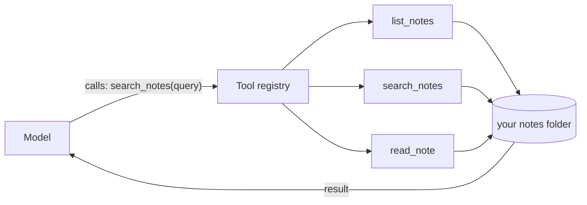

# 01 — What Is a Tool

## MOTTO
> A tool is a small promise: here is what it does, here is what it needs, here is what it gives back.

## PROBLEM
Ask a plain RAG pipeline "what did I write about agents?" and it searches once, guesses once. Now ask "which of my notes mention agents, and what does the evals note say?" — a pipeline cannot open a file, list a folder, or search twice. And a model that cannot read your files will *invent* their contents instead. The model needs hands.

## CONCEPT
A [tool / tool definition](../../../../glossary.md#tool--tool-definition) is a small program the model can call. A [tool schema](../../../../glossary.md#tool-schema) is the card that tells the model what the tool is: its `name`, a `description` (when to use it), and its `parameters` (the inputs, and their types). The model never sees your Python code — the schema is all it gets, so the description is the instruction manual.

A [tool registry](../../../../glossary.md#tool-registry) is one dict that holds every tool by name: look up `"search_notes"`, get its schema and its function. The model asks for a tool by name; your code looks it up, checks the arguments, runs the function, and hands the result back.



**Diagram (whiteboard):** open `diagrams/tool-registry.excalidraw` in excalidraw.com — same picture, traceable by hand.

## BUILD IT
A plain-Python tool registry over a small notes folder — no framework:

```bash
python3 lessons/01-what-is-a-tool/code/build.py
```

The build creates four sample notes, registers three tools (`list_notes`, `search_notes`, `read_note`) with schemas, prints the schemas exactly as a model would see them, then calls each tool and prints what it returns. Watch how the description of `read_note` teaches the model *when* to open a file — and how a bad call (unknown name, missing argument) fails loudly instead of silently.

## USE IT
LangChain's `@tool` decorator does the same registration in one line — from a function's docstring and type hints it builds the schema, and `bind_tools` attaches the tools to a model call.

| LangChain gives you | LangChain hides from you |
|---|---|
| `@tool` turns a function + docstring into a schema (pydantic) | your docstring IS the schema — it only works if you write it like a model reads it |
| tool binding + schema generation in one decorator | the JSON serialization and parsing errors in between |
| ready-made tool integrations (search, databases, code execution) | what each tool really costs in latency and tokens |

Honest trade-off: the decorator saves typing, but the *design* — a clear description, few parameters — is still yours. A tool with a lazy docstring is a broken tool in any framework.

## SHIP IT
The tool-design checklist — `outputs/artifact.md`: name like a verb, describe when to use it, keep parameters minimal and typed, test every tool by hand before the model ever sees it.
