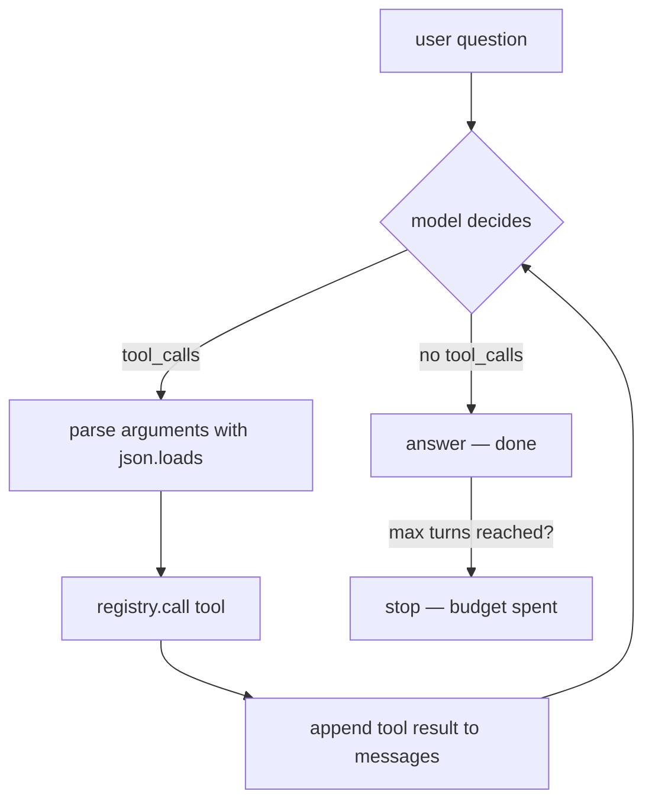

# 02 — The Agent Loop

## MOTTO
> The loop is the agent: decide, call, check, repeat — until it says done.

## PROBLEM
One-shot RAG answers once. "What did I write about agents?" needs one search. But "what did I write about agents, and does the evals note agree?" needs several steps: search, read, compare. A pipeline cannot change its plan mid-flight. The answer to "what if the first search finds nothing?" is not a better prompt — it is a loop.

## CONCEPT
The [agent loop](../../../../../glossary.md#agent-loop) is the pattern where the model decides what to do next, does it, looks at the result, and decides again. Each round is called a [turn](../../../../../glossary.md#max-turns). This is the [ReAct](../../../../../glossary.md#react) pattern: the model *reasons*, then *acts* (a [tool call](../../../../../glossary.md#tool-calling)), then *observes* the tool's result.

The trick that makes it work: the whole conversation — user question, every tool call, every tool result — stays in one growing `messages` list sent back to the model each turn. The model sees its own past calls. Tool calls arrive in the model's reply as JSON: `{"name": "search_notes", "arguments": "{\"query\": \"agents\"}"}` — your code runs `json.loads(arguments)` and calls the tool.



**Diagram (whiteboard):** open `diagrams/agent-loop.excalidraw` in excalidraw.com — same picture, traceable by hand.

## BUILD IT
The loop in plain Python — raw HTTP, plus a FAKE mode that simulates the model so it runs with no API key:

```bash
python3 lessons/02-the-agent-loop/code/build.py          # FAKE mode, keyless
OPENAI_API_KEY=... python3 lessons/02-the-agent-loop/code/build.py   # real
```

The build speaks the OpenAI-compatible chat format with `urllib` (stdlib): `POST {base}/chat/completions` with the message list; the reply's `choices[0].message.tool_calls` drives the loop. Each turn: append the model's message, parse `arguments` with `json.loads`, run the tool through the registry, append a `tool` message with the result, and repeat until the model returns plain text — or the `max_turns` budget (6) is spent. Watch the turn counter: a runaway agent is a money fire.

## USE IT
LangGraph draws the same loop as a graph — nodes and edges, with a built-in agent (`create_react_agent`).

| LangGraph gives you | LangGraph hides from you |
|---|---|
| the loop as a graph: nodes, edges, conditional edges | the message plumbing — roles, `tool_call_id`s, appends |
| [checkpointing](../../../../../glossary.md#memory): state saved across runs, replayable | the token cost of a growing message history |
| built-in tracing + streaming | the failure modes: bad JSON arguments, runaway turns |

Honest trade-off: LangGraph's `create_react_agent` is your loop in one line — but you only know what to configure (max turns, history trimming, error handling) because you just built the loop by hand.

## SHIP IT
The agent-loop checklist — `outputs/artifact.md`: messages accumulate, tool results are always appended, `json.loads` guarded, max turns budgeted, every turn logged.
