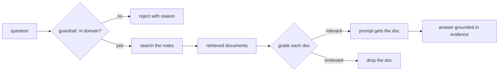

# 03 — Guardrails and Grading

## MOTTO
> Guardrails stop bad questions; grading stops bad evidence.

## PROBLEM
An agent with tools will happily search your notes for "best pizza in London" — and answer from *nothing*, confidently. Worse, it can answer from the *wrong* note: the word "agents" appears in your python note, so it gets retrieved, and the agent builds a confident answer on the wrong document. Two different failures: the question is out of bounds, and the evidence is off-topic. One guardrail, one grade.

## CONCEPT
A [guardrail](../../../../glossary.md#guardrail) is a rule that stops the flow when the input is out of bounds. For a notes assistant the domain is your knowledge: [out-of-domain](../../../../glossary.md#out-of-domain) means the question names no topic you have notes on. The guardrail checks the question against the domain *before any tool runs* — reject early, with a reason.

[Grading](../../../../glossary.md#grading) checks the other side: each document a search returns is scored for how well it answers the query, then labeled [relevant or irrelevant](../../../../glossary.md#relevant--irrelevant). Only relevant documents may reach the prompt. In module 06 you graded the *answer*; here you grade the *evidence*, before the model ever sees it.



**Diagram (whiteboard):** open `diagrams/guardrails-grading.excalidraw` in excalidraw.com — same picture, traceable by hand.

## BUILD IT
Both checks in plain Python — no model calls needed:

```bash
python3 lessons/03-guardrails-and-grading/code/build.py
```

The build defines the domain (your topic list), a `guard_question` that accepts or rejects with a reason, and a `grade_doc` that scores a document by word overlap with the query and labels it relevant/irrelevant against a threshold. Then it runs a battery: an in-domain question, an out-of-domain question, a relevant document, and a decoy — every verdict printed with its score. Watch the numbers: the threshold is a dial, and a decoy that scores 0.24 while the real note scores 0.80 is the whole lesson in one table.

## USE IT
In LangGraph these become nodes and conditional edges — routing, not if/else in a function.

| LangGraph gives you | LangGraph hides from you |
|---|---|
| conditional edges: the graph routes accept → search, reject → stop | your guardrail logic — the graph won't invent your domain |
| persistent state so nodes share the verdict | the cost: an LLM-as-judge grader is a model call per document |
| structured output for grader verdicts | threshold tuning and the judge prompt stay yours |

Honest trade-off: LangGraph makes the routing visible (you can *see* the reject branch), but the two hard parts — what your domain is, and what "relevant" means — are still decisions you make.

## SHIP IT
The guardrail + grading checklist — `outputs/artifact.md`: domain defined up front, reject with a reason, every retrieved doc graded before it reaches the prompt, scores logged, no irrelevant doc in the context.
