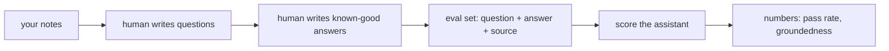

# 01 — Build an Eval Set

## MOTTO
> Vibes say "it feels right." Numbers say "it is right." Write the numbers down before you ship.

## PROBLEM
You ask your assistant three questions. It answers well. You ship it. A week later someone asks a fourth question and gets a confident, wrong answer — made up from nothing. You cannot fix what you never measured, and three questions are not a measure.

## CONCEPT
An [eval set](../../../../../glossary.md#eval-set) is a list of questions with [known-good answers](../../../../../glossary.md#known-good-answer). A human writes both — the question and the answer that is correct. That human-written answer is the [ground truth](../../../../../glossary.md#ground-truth): the real answer, known before the model ever speaks.

Think of it as tests for code. You do not judge a function by staring at it — you run it against tests with expected answers. An eval set is the same for an assistant: expected answers, written down, before the assistant is judged.

Each question also carries a [label](../../../../../glossary.md#label): which note (or notes) the answer lives in. That label lets you measure not just the answer, but whether the right note was even found.



**Diagram (whiteboard):** open `diagrams/eval-set.excalidraw` in excalidraw.com — same picture, traceable by hand.

## BUILD IT

```bash
python3 lessons/01-build-an-eval-set/code/build.py
```

A six-note corpus and six labeled questions. Run it — it validates every question (answer present, source note exists) and writes `eval_set.json`. That JSON is the ruler you will score with in lesson 02. Note the two fields that make this a *labeled* set and not a list of questions: `answer` and `source`.

## USE IT
[LangSmith](../../../../../glossary.md#trace) datasets and RAGAS give you the same idea hosted: a UI to write questions, a place to store them, versioning.

| Tool gives you | Tool hides from you |
|---|---|
| hosted eval sets, labeling UI, versioning | the labeling effort — a human must still write every answer |
| easy integration with runs | the data contract: what "good" means for YOUR task |
| dashboards over many evals | that a bad label quietly poisons every score |

Honest trade-off: no tool writes your labels. The eval set is human work either way — a file is the honest start.

## SHIP IT
The labeled eval set — `outputs/artifact.md`: the checklist for building an eval set that will actually catch bad answers.
