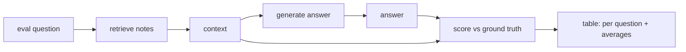

# 02 — Score Your Assistant

## MOTTO
> Score every answer. The average hides the worst one.

## PROBLEM
You have an eval set now, but you still do not know if your assistant passes it. You spot-check two answers — they look good. That is a vibe again, just with extra steps. You need a number for every question, and one number for the whole set.

## CONCEPT
Scoring is a fixed pipeline: for each [eval set](../../../../../glossary.md#eval-set) question, retrieve notes, generate an answer, then compare against the [ground truth](../../../../../glossary.md#ground-truth) — with numbers.

Three numbers matter:

- **[Groundedness](../../../../../glossary.md#groundedness)** — the share of the answer's words that came from the retrieved notes. An answer full of words that are not in the notes is [hallucinating](../../../../../glossary.md#hallucination): making things up.
- **[Recall](../../../../../glossary.md#recall)** — of the notes that SHOULD answer the question, how many did we fetch? If the right note never gets found, no model can answer well.
- **Pass rate** — the share of questions scored high enough to ship. One number for the whole set.

A [fake LLM](../../../../../glossary.md#fake-mode) stands in for the real model: it cannot think, but it lets you run the whole scoring loop without an API key. Run it twice — once honest, once "flaky" — and watch the numbers catch the flaky answers.



**Diagram (whiteboard):** open `diagrams/score.excalidraw` in excalidraw.com — same picture, traceable by hand.

## BUILD IT

```bash
python3 lessons/02-score-your-assistant/code/build.py          # honest model
python3 lessons/02-score-your-assistant/code/build.py --flaky  # a model that lies
```

A tiny BM25 retriever (from module 03, reduced to its bones), a fake LLM with two personalities, and three scoring functions. The `--flaky` run shows two questions with low groundedness — the invented facts are visible as numbers before any user sees them.

## USE IT
[RAGAS](../../../../../glossary.md#grading) and DeepEval ship these metrics ready-made.

| Tool gives you | Tool hides from you |
|---|---|
| groundedness/faithfulness metrics out of the box | that they often run an LLM-as-judge — each score costs tokens |
| retriever + generator scoring | the exact definition of "grounded" for your data |
| a dashboard over runs | the labeling effort and the threshold choice |

Honest trade-off: ready metrics save time, but they can quietly cost more than the answer generation itself. Word-level groundedness is crude and free — start there.

## SHIP IT
The scoring harness — `outputs/artifact.md`: how to read a score table and know what to fix next.
