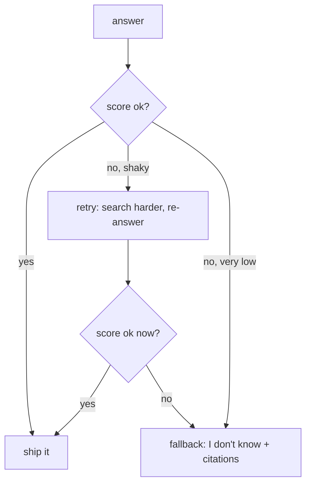

# 03 — The Grade Gate

## MOTTO
> An assistant that knows when to say "I don't know" is worth more than one that always answers.

## PROBLEM
Lesson 02 found two answers with low [groundedness](../../../../../glossary.md#groundedness) — but nothing stopped them. They were still sent to the user. A confident wrong answer is the worst failure mode there is: the user cannot tell it is wrong, so they trust it.

## CONCEPT
The [grade gate](../../../../../glossary.md#grade-gate) is a check between the answer and the user. It reads the score and decides:

- **pass** — the score is good enough. Ship it.
- **retry** — the score is shaky. Try once more: search harder (more notes), regenerate, re-score.
- **fallback** — even the retry is bad. Do not guess. Return "I don't know" with [citations](../../../../../glossary.md#citations) — the notes you did find.

The gate does not make the model smarter. It makes the assistant *honest*: bad answers become refusals instead of lies. [Recall](../../../../../glossary.md#recall) and groundedness tell you *what* is wrong; the gate decides *what to do about it* — the two halves of the same loop.



## BUILD IT

```bash
python3 lessons/03-the-grade-gate/code/build.py          # honest model — everything passes
python3 lessons/03-the-grade-gate/code/build.py --flaky  # the liar gets caught
```

The gate from lesson 02's scoring: `decide()` routes each score, a retry re-searches with more context, and a fallback refuses with citations. The `--flaky` run shows the before/after: two hallucinated answers before, zero shipped after — replaced by honest "I don't know" replies.

## USE IT
Graph frameworks ([LangGraph](../../../../../glossary.md#langgraph), Pydantic AI) model the same decision as a conditional edge in the graph.

| Framework gives you | Framework hides from you |
|---|---|
| gate as a declarative edge, easy to draw | the threshold — someone must still pick the number |
| retry wiring built in | the retry policy — how many tries, how much more context |
| guardrail hooks | that fallbacks only work if you write good citations |

Honest trade-off: the graph is a nicer picture of the same three boxes. The decision logic — threshold, retry budget, fallback text — is yours either way.

## SHIP IT
The grade gate — `outputs/artifact.md`: the checklist for adding a gate that keeps bad answers away from users.
